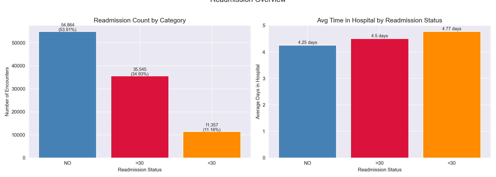
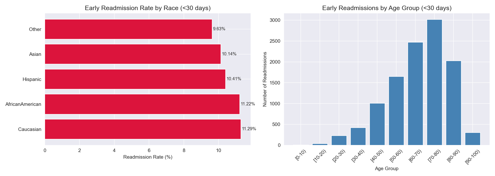
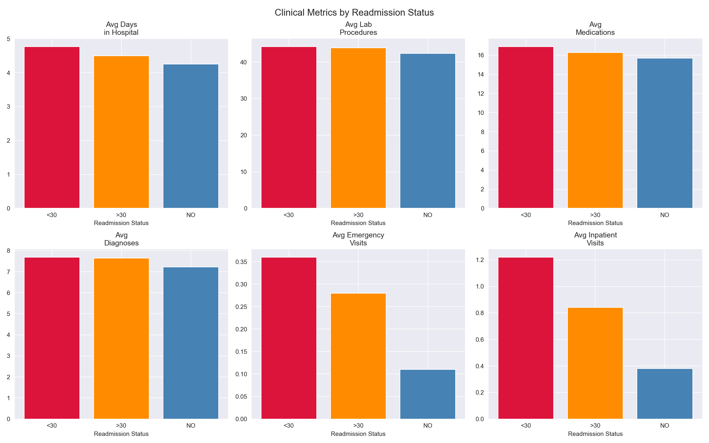
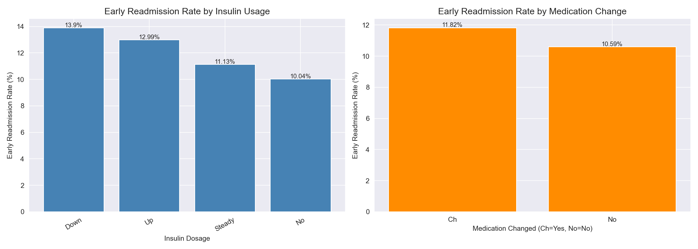
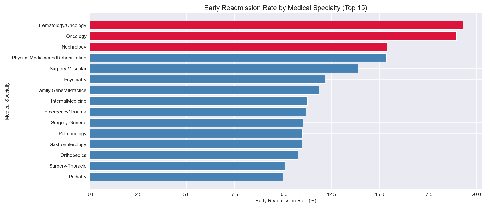
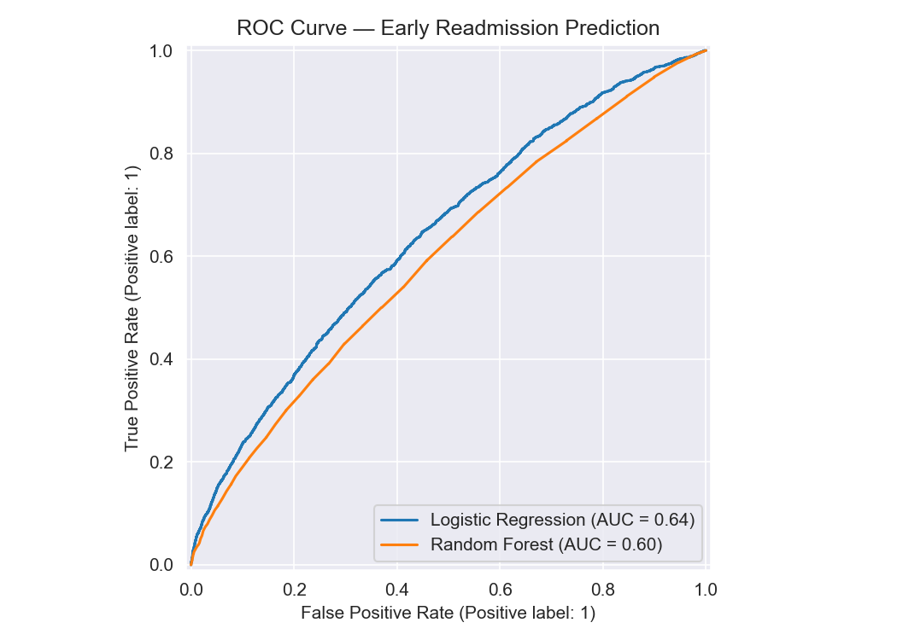
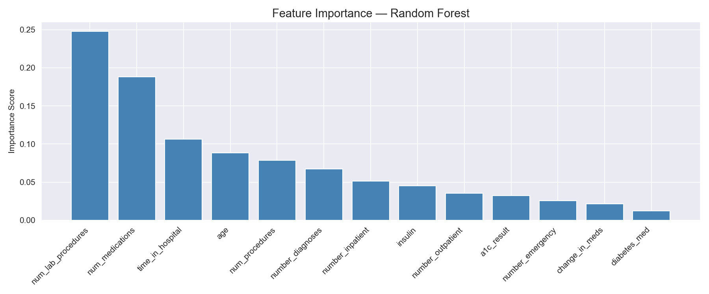
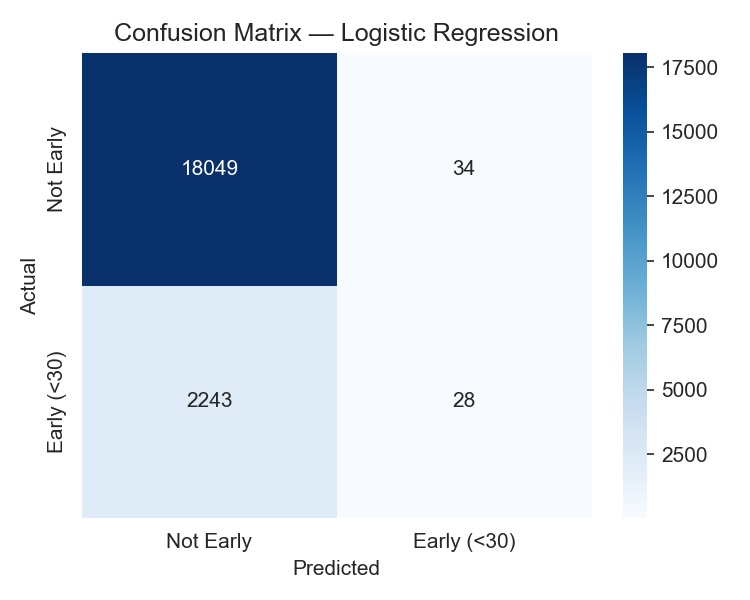
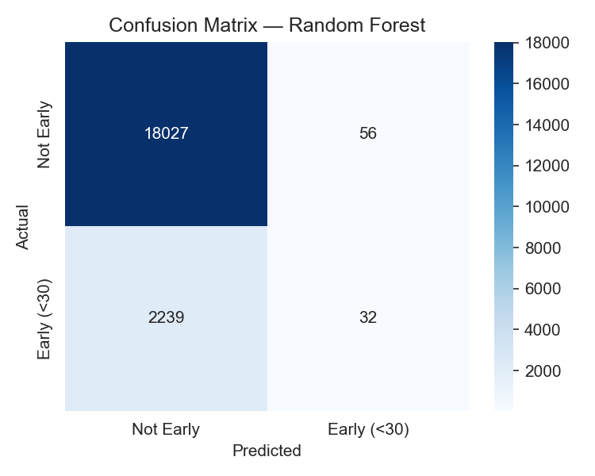

# Hospital Readmission Analysis — Diabetes Patients

A SQL and Python analysis of 10 years of clinical encounter data from 130 U.S. hospitals, identifying which diabetic patients are most at risk of early readmission within 30 days using PostgreSQL, Python, and machine learning.

---

## Problem Statement
Hospital readmissions are a critical quality and cost metric for healthcare institutions. Under the Centers for Medicare & Medicaid Services (CMS) Hospital Readmissions Reduction Program (HRRP), hospitals face direct
reimbursement penalties for excessive 30-day readmissions in conditions including diabetes. Early readmission often signals inadequate treatment or premature discharge — outcomes that harm both patients and institutions.

This project analyzes 101,766 diabetic patient encounters to answer: **Which patients are most at risk of being readmitted within 30 days, and what clinical factors drive that risk?**

---

## Dataset
- **Source:** [Kaggle — Diabetes 130-US Hospitals Dataset](https://www.kaggle.com/datasets/brandao/diabetes)
- **Size:** 101,766 encounters, 50 features
- **Period:** 1999–2008, 130 U.S. hospitals
- **Criteria:** Inpatient diabetic encounters with lab tests and medications administered, length of stay 1–14 days
- **Database:** PostgreSQL (local)

---

## Tools & Libraries
- PostgreSQL, pgAdmin
- Python 3.x
- Pandas, NumPy
- Matplotlib, Seaborn
- Scikit-learn
- SQLAlchemy, psycopg2

---

## Project Workflow
1. Data ingestion — loaded CSV into PostgreSQL via Python, renamed columns to SQL-compatible snake_case, replaced missing value placeholders ('?') with NULL
2. SQL analysis — patient demographics, readmission metrics, medication patterns, specialty risk stratification using window functions
3. Python visualization — pulled SQL results into Pandas DataFrames and built charts for each analysis area
4. Predictive modeling — binary classification (early readmission vs. not) using Logistic Regression and Random Forest with 5-fold cross-validation

---

## SQL Techniques Demonstrated
- Common Table Expressions (CTEs)
- Window functions (RANK, SUM OVER, PARTITION BY)
- Conditional aggregation (CASE WHEN)
- HAVING clause for minimum encounter thresholds
- NULLIF for safe division
- Multi-table aggregation and subqueries

---

## Key Findings
- **11.16%** of diabetic encounters resulted in early readmission (<30 days) — a financially significant metric given CMS penalty structures for excessive readmissions
- Early readmission patients averaged **1.22 prior inpatient visits** and **0.36 emergency visits** — more than 3x the rate of non-readmitted patients, identifying prior utilization as the strongest readmission signal
- **Hematology/Oncology** carried the highest early readmission rate at **19.32%** — nearly double the rate of high-volume specialties like Internal Medicine (11.25%)
- **Nephrology** (15.38%) and **Physical Medicine & Rehab** (15.35%) represent high-volume, high-risk specialties that should be prioritized for post-discharge care coordination programs
- Both models achieved 89% accuracy but near-zero recall for early readmissions — a textbook example of why accuracy is a misleading metric for imbalanced clinical datasets
- Logistic Regression outperformed Random Forest on ROC-AUC (0.64 vs 0.60) with more consistent cross-validation scores — a rare case where the simpler model is the more reliable choice
- Next iteration should apply SMOTE and incorporate ICD diagnostic code groupings to substantially improve predictive power

---

## Visualizations

### Readmission Overview

### Demographics Analysis

### Clinical Metrics by Readmission Status

### Medication & Insulin Analysis

### Specialty Risk Stratification

### ROC Curve Comparison

### Feature Importance

### Confusion Matrices

---

## SQL Query Files
All queries are saved in the `sql/` folder:
- `01_create_table.sql` — schema creation
- `02_patient_demographics.sql` — demographics by readmission status
- `03_readmission_analysis.sql` — clinical metrics by readmission category
- `04_medication_analysis.sql` — insulin and medication change analysis
- `05_window_functions.sql` — specialty risk stratification with ranking

---

## Limitations & Next Steps
- Severe class imbalance (11.16% early readmission) was not addressed with SMOTE in this iteration — a critical next step for improving recall
- Dataset spans 1999–2008; treatment protocols have evolved significantly since then
- Diagnostic codes (diag_1, diag_2, diag_3) were excluded from modeling due to complexity — incorporating ICD code groupings could substantially improve predictive power
- Social determinants of health (housing, transportation, support systems) are absent but are known drivers of readmission
- Future work: SMOTE oversampling, XGBoost with class weighting, ICD code feature engineering, discharge risk scoring tool

---

## How to Run This Project
1. Clone the repository
2. Install PostgreSQL and pgAdmin from [postgresql.org](https://postgresql.org)
3. Create a database called `hospital_readmission` in pgAdmin
4. Download `diabetic_data.csv` from [Kaggle](https://www.kaggle.com/datasets/brandao/diabetes) and place it in the project root folder
5. Install Python dependencies: `pip install pandas numpy matplotlib seaborn scikit-learn sqlalchemy psycopg2-binary`
6. Open `hospital_readmission.ipynb` in Jupyter or VS Code
7. Update the database connection string with your PostgreSQL password
8. Run all cells — data loads automatically into PostgreSQL and all analysis runs end to end

---

## Repository Structure

---

## Author
**Mihrimah Qozat**
[LinkedIn](https://linkedin.com/in/mihrimah-qozat/) | [GitHub](https://github.com/mihrimahqozat)
